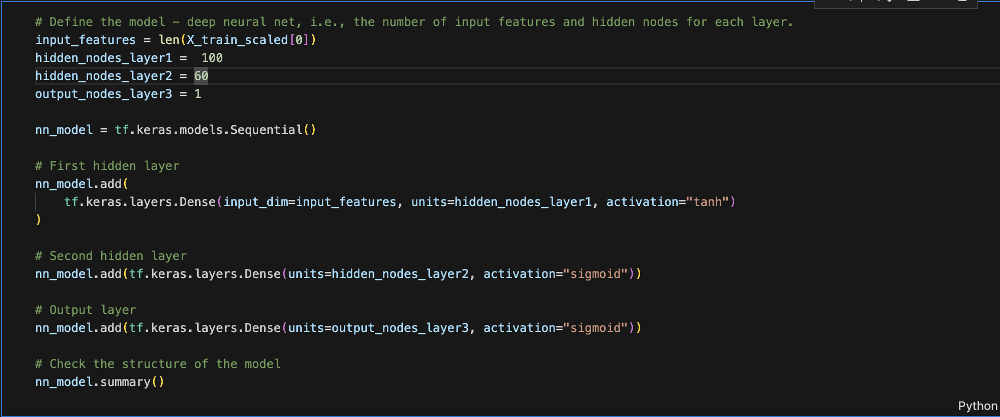
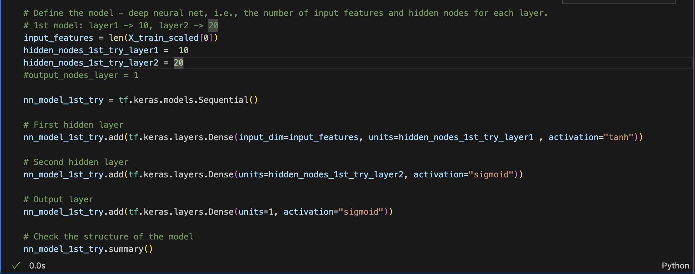
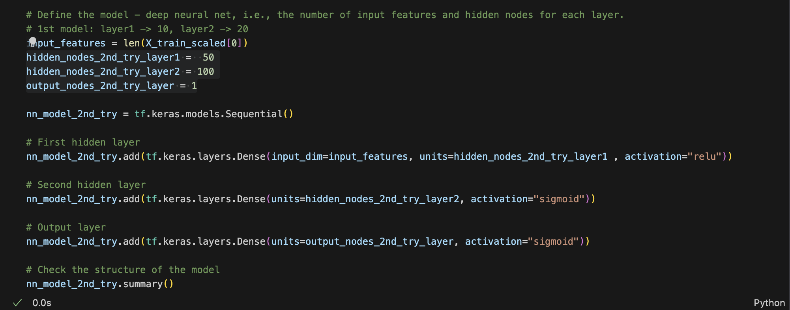
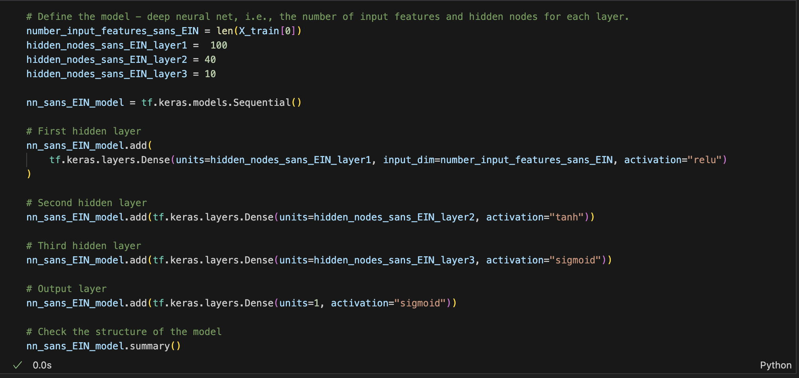
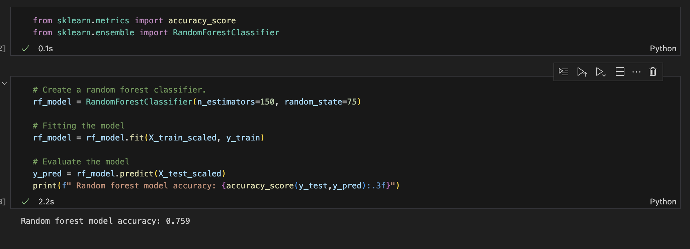

# deep-learning-challenge
Module 21 Challenge deep-learning-challenge
***
# Introduction

The nonprofit foundation Alphabet Soup wants a tool that can help it select the applicants for funding with the best chance of success in their ventures. 

## Purpose of the Analysis
With your knowledge of machine learning and neural networks, the analysis will use the features in the provided dataset to create a binary classifier that can predict whether applicants will be successful if funded by Alphabet Soup.

# Findings
## Data Processing
### What variable(s) are the target(s) for your model?
* The 'IS_SUCCESSFUL' column from application_df is the target variable, this is what we are trying to predict. This shows if the money was used effectively.
### What variable(s) are the features for your model?
* The feature variables we used are:
    * AFFILIATION—Affiliated sector of industry
    * CLASSIFICATION—Government organization classification
    * USE_CASE—Use case for funding
    * ORGANIZATION—Organization type
    * STATUS—Active status
    * INCOME_AMT—Income classification
    * SPECIAL_CONSIDERATIONS—Special considerations for application
    * ASK_AMT—Funding amount requested
### What variable(s) should be removed from the input data because they are neither targets nor features?
* Identification columns: The "EIN" and "NAME" columns are identification columns that typically provide unique identifiers for each organization. These columns usually have no direct impact on the target variable and can be dropped without affecting the model's accuracy.
    * Note: for the Optimized version, only "EIN" is removed so we can use "NAME" as a part of the features

## Compiling, Training, and Evaluating the Model
### How many neurons, layers, and activation functions did you select for your neural network model, and why?
* The 1st/original neural network model, I used a two-layer architecture with a specific choice for the number of neurons, layers, and activation functions.
    * input_features = len(X_train_scaled[0])
    * hidden_nodes_layer1 =  100
    * hidden_nodes_layer2 = 60
    * output_nodes_layer3 = 1

* Choosing 100 neurons for the 1st layer and 60 neurons for the 2nd, with combining both the "tanh" for the 1st activation and "sigmoid" for the 2nd, the model aims to find a balance between a "zero-centered" activation like "tanh" and logistic regression like "sigmoid"

### Were you able to achieve the target model performance?
* The target performance was set at 75%. The original model I chose did not meet that target, unfortunately. The model I chose only went up to 72.4% accuracy

### What steps did you take in your attempts to increase model performance?
* Optimazation 1 - Less Neurons, Less layers
    * input_features = len(X_train_scaled[0])
    * hidden_nodes_1st_try_layer1 =  10
    * hidden_nodes_1st_try_layer2 = 20

    * This model yielded a disappointing 72.3%, not meeting the target at all

* Optimization 2 - More Layers, More Neurons, "relu" for the first layer activation, and "sigmoid" for the second layer activation
    * hidden_nodes_2nd_try_layer1 =  50
    * hidden_nodes_2nd_try_layer2 = 100
    * output_nodes_2nd_try_layer = 1

* This model only yeilded a slight accuracy increase of 72.53%, not meeting the target at all

* Optimization 3 - I took a different approach by doing the following:
    * Put "NAME" column back into the DataFrame to be used as another "feature"
        * Placed a limit of "20" applications for grants as a cut-off limit to see if the accuracy would increase
    * increased the numbef of layers
    * combined "relu" and "tanh" activation for a balanced approach of using linear regression and effeciency 

    * This model yielded the most optimal of results at 77.25 accuracy

***
# Conclusion

Overall, by optimizing the model using the changes made to the 3rd optimization model as described above, we are able to increase the accuracy to 77.25%. 

This means we are able to correctly classify each of the points in the test data 77.25% of the time. In other words an applicant has a close to 80% chance of being successful if they have the following:

- The NAME of the applicant appears more than <b>20 times (they have applied more than 20 times)</b>
- The type of APPLICATION is one of the following: <b>T3, T4, T5, T6, and surprisingly, T19!</b>
- The application has the following values for CLASSIFICATION: C1000, C1200, C2000,C2100, C3000, and C7000.

-----
#### Alternative Model
An alternative model to recommend is the Random Forest model as it is suited for classification problems. As can be seen below, using the Random Forest model we can achieve SLIGHTLY above 75% accuracy. 

